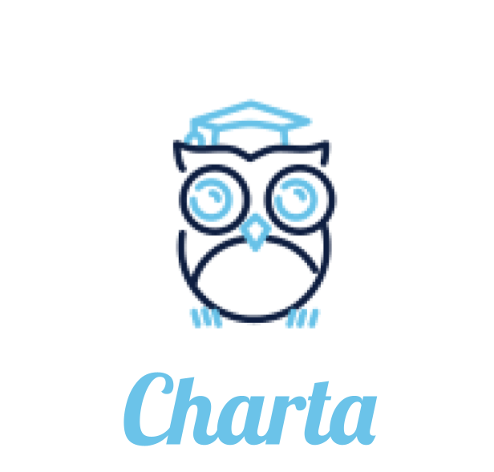
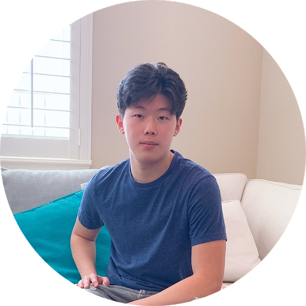
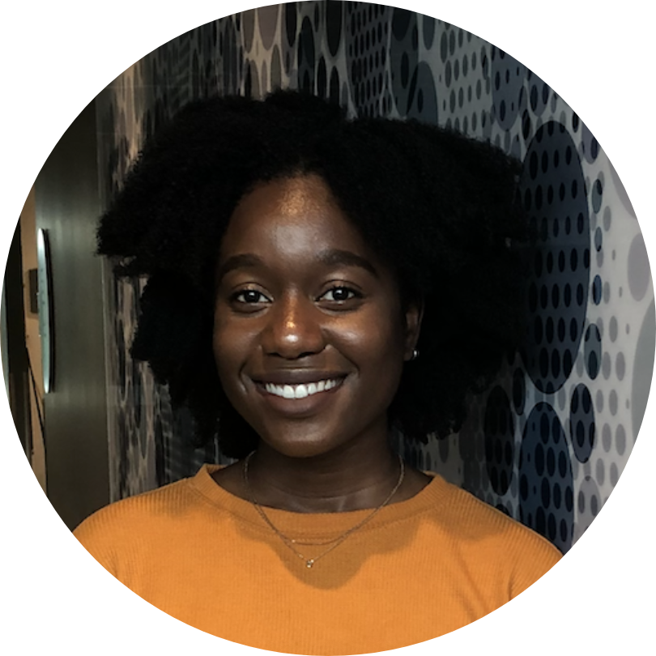

  

**Charting your course to graduation**

Most students don’t graduate from college on time; one-third never will. This is an existential crisis to higher education. We are solving this problem by building a software platform to help students chart their course to graduation and allowing school administrators to identify those at-risk for dropping out. 

  
   
   
   

| Member  | Skills  | Personal traits  | Desired growth  | Weaknesses  |
|---|---|---|---|---|
| Ruben Krueger  |  Python, leadership |  Intellectually-curious; hates Silicon Valley, programming, and the CS major |  Full-stack development |  Machine learning, web development |
|Tony Kim   |  Back-end development, Python, presentations, data science | Critical thinker, detail-orientated  |  Web development, coding conventions, product development | Front-end development|
| Abi Olawale  | Programming, React Native, Web development  | Quick learner  |  Back-end development best practices | Time management  |
| Kendra Dunsmoor  | Programming, back end | Team player, mediator  | React, presentation, skills, milestone planning  | UI design, disorganized  |
