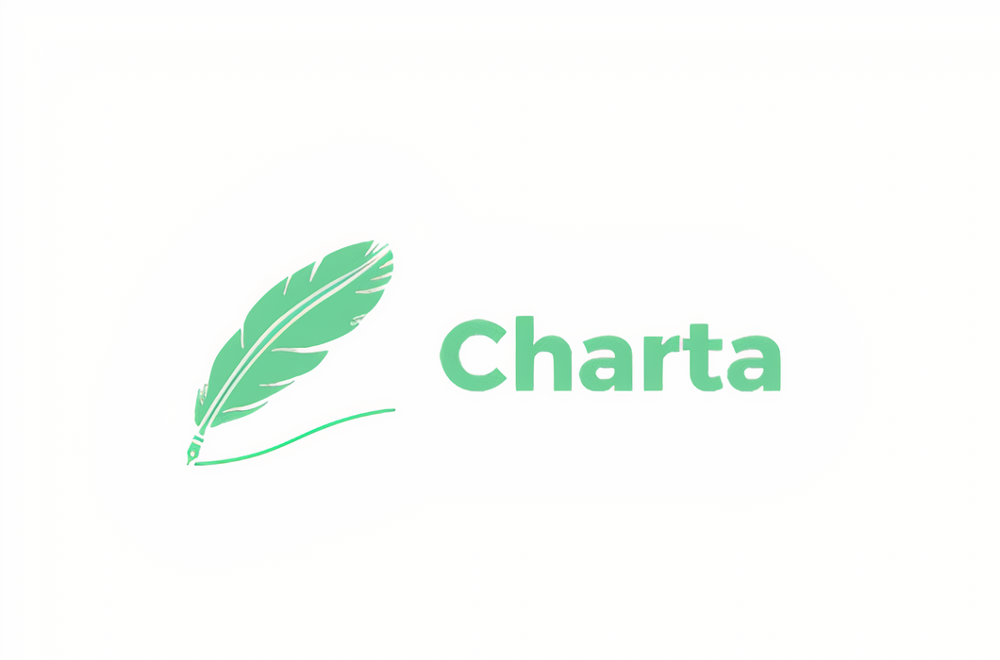
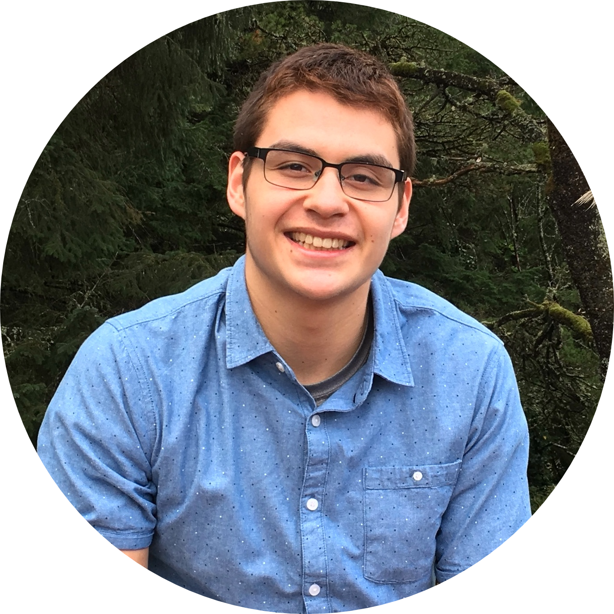
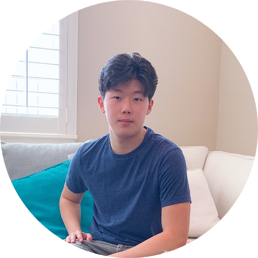
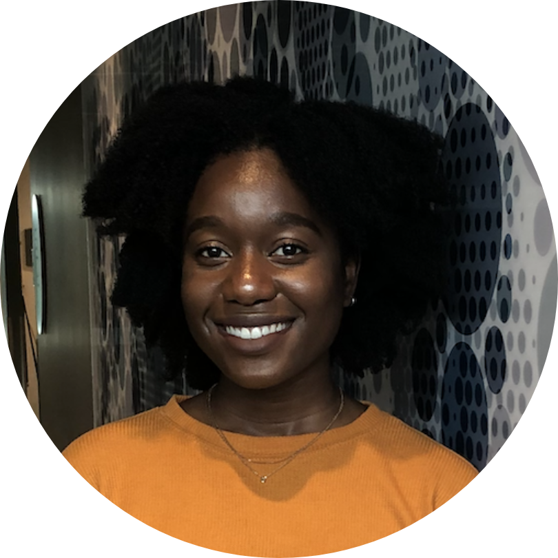

  

### Synopsis

Most students don’t graduate from college on time; one-third never will. This is an existential crisis to higher education. Moreover, students who don't finish college do not reap the benefits of a degree: a happier, healthier, and wealthier life. We are solving this problem by building a software platform to help students chart their course to graduation and allowing school administrators to identify those at-risk for dropping out. 

| Member   | Skills  | Personal traits  | Desired growth  | Weaknesses  |
|---|---|---|---|---|
| Ruben Krueger    |Python, leadership |  Intellectually-curious; hates Silicon Valley, programming, and the CS major |  Full-stack development |  Machine learning, web development |
|Tony Kim     | Back-end development, Python, presentations, data science | Critical thinker, detail-orientated  |  Web development, coding conventions, product development | Front-end development|
| Abi Olawale    |Programming, React Native, Web development  | Quick learner  |  Back-end development best practices | Time management  |
| Kendra Dunsmoor  | Programming, back end | Team player, mediator  | React, presentation skills, milestone planning  | UI design, disorganized  |

### Contact

We communicate through Slack, and you can reach us through email or carrier pigeon.

**Emails:**
* ruben1@stanford.edu
* tkim6@stanford.edu
* aolawale@stanford.edu
* kendraj@stanford.edu
